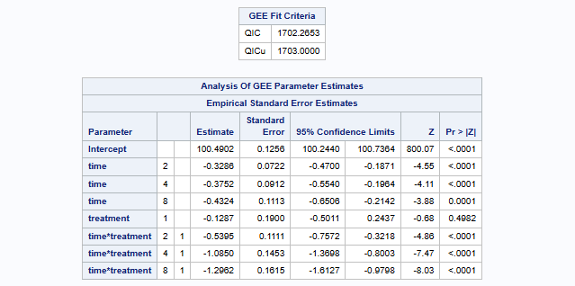
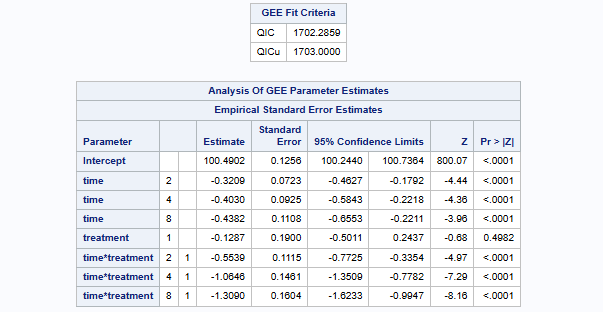
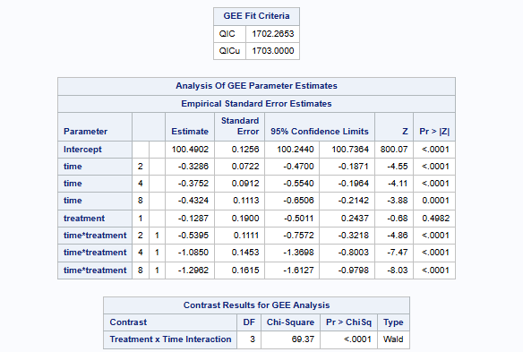
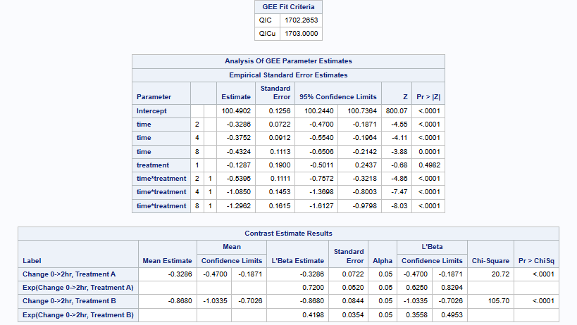

# P8110 Applied Regression II - Homework 8

**Name:** Xuange Liang
**UNI:** xl3493
**Date:** December 3, 2025

---

<!-- ## Background

In a study of septic patients, each patient's temperature was measured at baseline, and 2, 4, and 8 hours after entry into study. Patients were randomly assigned to two treatment groups at baseline. Patients' APACHE scores were also measured.

### Data Description

| Variable | Description |
|----------|-------------|
| ID | Patient ID |
| temp | Patient's temperature |
| treatment | 1 = Treatment B, 0 = Treatment A |
| apache | APACHE score at baseline |
| time | 0, 2, 4, 8 hours after entry into study |

### Data Summary

- **Number of patients:** 455
- **Number of observations:** 1820
- **Missing values in temperature:** 125

--- -->

## Question 1

**Fit a GEE model with temperature as outcome and time, treatment, and their interactions as covariates. Write the mean response of the GEE model and treat time as a categorical variable.**

### SAS Code

```sas
PROC GENMOD DATA=tempdata;
    CLASS ID time(REF='0') treatment(REF='0') / PARAM=REF;
    MODEL temp = time treatment time*treatment / DIST=NORMAL;
    REPEATED SUBJECT=ID / TYPE=CS CORRW;
RUN;
```

### SAS Output


### Mean Response Model

The mean response of the GEE model treating time as a categorical variable is:

$$E(Y_{ij}) = \mu_{ij} = \beta_0 + \beta_1 \cdot I(\text{time}_{ij}=2) + \beta_2 \cdot I(\text{time}_{ij}=4) + \beta_3 \cdot I(\text{time}_{ij}=8)$$

$$+ \beta_4 \cdot I(\text{treatment}_{i}=B) + \beta_5 \cdot I(\text{time}_{ij}=2) \cdot I(\text{treatment}_{i}=B)$$

$$+ \beta_6 \cdot I(\text{time}_{ij}=4) \cdot I(\text{treatment}_{i}=B) + \beta_7 \cdot I(\text{time}_{ij}=8) \cdot I(\text{treatment}_{i}=B)$$

**Where:**
- $Y_{ij}$ = temperature for patient $i$ at time point $j$
- $I(\cdot)$ = indicator function
- $\beta_0$ = mean temperature at baseline (time=0) for Treatment A
- $\beta_1, \beta_2, \beta_3$ = effects of time 2, 4, 8 (vs baseline) for Treatment A
- $\beta_4$ = effect of Treatment B vs A at baseline
- $\beta_5, \beta_6, \beta_7$ = interaction effects (difference in time effects between treatments)

---

## Question 2

**Try different working correlation structures (CS, AR(1), and UN) for the GEE model in (1). Which model yields the best QIC value? Show the SAS code and relevant SAS output.**

### SAS Code

```sas
/* Compound Symmetry (CS) / Exchangeable */
PROC GENMOD DATA=tempdata;
    CLASS ID time(REF='0') treatment(REF='0') / PARAM=REF;
    MODEL temp = time treatment time*treatment / DIST=NORMAL;
    REPEATED SUBJECT=ID / TYPE=CS CORRW;
RUN;

/* AR(1) */
PROC GENMOD DATA=tempdata;
    CLASS ID time(REF='0') treatment(REF='0') / PARAM=REF;
    MODEL temp = time treatment time*treatment / DIST=NORMAL;
    REPEATED SUBJECT=ID / TYPE=AR(1) CORRW;
RUN;

/* Unstructured */
PROC GENMOD DATA=tempdata;
    CLASS ID time(REF='0') treatment(REF='0') / PARAM=REF;
    MODEL temp = time treatment time*treatment / DIST=NORMAL;
    REPEATED SUBJECT=ID / TYPE=UN CORRW;
RUN;
```

### SAS Output - QIC Comparison

#### Compound Symmetry (CS)


#### AR(1)



#### Unstructured



### QIC Comparison Table

| Correlation Structure | QIC | QICu |
|-----------------------|-----|------|
| Compound Symmetry (CS) | 1702.40 | 1703.00 |
| **AR(1)** | **1702.27** | **1703.00** |
| Unstructured | 1702.29 | 1703.00 |

### Answer

Comparing the QIC values from the three correlation structures:

- CS: QIC = 1702.40
- AR(1): QIC = 1702.27
- UN: QIC = 1702.29

The **AR(1)** model has the lowest QIC value (1702.27), so it is the best model. I will use the AR(1) correlation structure for the following questions.

---

## Question 3

**Use the model selected in (2) to test whether the trajectory of temperature over time is different between the two treatments. Write down the hypothesis, test statistic, p-value, and conclusion.**

### SAS Code

```sas
PROC GENMOD DATA=tempdata;
    CLASS ID time(REF='0') treatment(REF='0') / PARAM=REF;
    MODEL temp = time treatment time*treatment / DIST=NORMAL;
    REPEATED SUBJECT=ID / TYPE=AR(1) CORRW;
    /* Joint test for interaction terms */
    CONTRAST 'Treatment x Time Interaction' 
        time*treatment 1 0 0,
        time*treatment 0 1 0,
        time*treatment 0 0 1 / WALD;
RUN;
```

### SAS Output



### Answer

**Hypothesis:**

- $H_0$: $\beta_5 = \beta_6 = \beta_7 = 0$ (no treatment-by-time interaction)
- $H_a$: At least one $\beta_j \neq 0$ for $j = 5, 6, 7$

**Test Statistic:** Wald $\chi^2$ = 69.37, df = 3

**P-value:** < 0.0001

**Conclusion:** Since p < 0.0001 < 0.05, we reject $H_0$. There is a significant difference in temperature trajectory over time between the two treatment groups.

---

## Question 4

**Use the model selected in (2) to estimate the mean temperature change from baseline to two hours after entry into study for patients in treatment A group and those in treatment B group, respectively.**

### SAS Code

```sas
PROC GENMOD DATA=tempdata;
    CLASS ID time(REF='0') treatment(REF='0') / PARAM=REF;
    MODEL temp = time treatment time*treatment / DIST=NORMAL;
    REPEATED SUBJECT=ID / TYPE=AR(1) CORRW;
    
    /* Treatment A: Change from time=0 to time=2 = beta1 */
    ESTIMATE 'Change 0->2hr, Treatment A' time 1 0 0;
    
    /* Treatment B: Change from time=0 to time=2 = beta1 + beta5 */
    ESTIMATE 'Change 0->2hr, Treatment B' time 1 0 0 time*treatment 1 0 0;
RUN;
```

### SAS Output



### Calculation Explanation

**For Treatment A (treatment = 0):**
- Mean at time 0: $E(Y|time=0, trt=A) = \beta_0$
- Mean at time 2: $E(Y|time=2, trt=A) = \beta_0 + \beta_1$
- **Change from baseline to time 2 = $\beta_1$ = -0.329**

**For Treatment B (treatment = 1):**
- Mean at time 0: $E(Y|time=0, trt=B) = \beta_0 + \beta_4$
- Mean at time 2: $E(Y|time=2, trt=B) = \beta_0 + \beta_1 + \beta_4 + \beta_5$
- **Change from baseline to time 2 = $\beta_1 + \beta_5$ = -0.329 + (-0.540) = -0.868**

### Answer

**Treatment A:**

- Mean temp change from baseline to 2 hours = $\beta_1$ = **-0.329** (SE = 0.0722, 95% CI: -0.470, -0.187)

**Treatment B:**

- Mean temp change from baseline to 2 hours = $\beta_1 + \beta_5$ = -0.329 + (-0.540) = **-0.868** (SE = 0.0844, 95% CI: -1.034, -0.703)

Both groups show a decrease in temperature, but Treatment B shows a larger decrease.

---

## Question 5

**Calculate the difference of the two estimates in (4). Denote the difference as DIFF. Which β coefficient does DIFF represent? Interpret this β coefficient.**

### SAS Code

```sas
PROC GENMOD DATA=tempdata;
    CLASS ID time(REF='0') treatment(REF='0') / PARAM=REF;
    MODEL temp = time treatment time*treatment / DIST=NORMAL;
    REPEATED SUBJECT=ID / TYPE=AR(1) CORRW;
    
    /* DIFF = Change_B - Change_A = (beta1 + beta5) - beta1 = beta5 */
    ESTIMATE 'DIFF: Change_B - Change_A' time*treatment 1 0 0;
RUN;
```

### SAS Output


### Answer

**DIFF Calculation:**

$$\text{DIFF} = \text{Change}_B - \text{Change}_A = (\beta_1 + \beta_5) - \beta_1 = \beta_5 = -0.540$$

**Which β does DIFF represent?**

DIFF = $\beta_5$, the interaction coefficient for time=2 and treatment=B.

**Interpretation:**

$\beta_5 = -0.540$ means that the temperature change from baseline to 2 hours is 0.540 degrees **lower** (greater decrease) for Treatment B compared to Treatment A. The 95% CI (-0.757, -0.322) does not include 0, so this difference is statistically significant (p < 0.0001).

---

<!-- ## Summary

| Question | Key Finding |
|----------|-------------|
| Q1 | GEE model with time × treatment interaction using robust SE |
| Q2 | AR(1) correlation structure has lowest QIC (1702.27) |
| Q3 | Significant treatment × time interaction (χ² = 69.37, p < 0.0001) |
| Q4 | Treatment A: -0.329°F change; Treatment B: -0.868°F change |
| Q5 | DIFF = β₅ = -0.540°F, Treatment B decreases temp more than A |

--- -->
<!-- 
## Appendix: Complete SAS Code

```sas
/*******************************************************************************
 * P8110 Applied Regression II - Homework 8
 * GEE Analysis for Septic Patients Temperature Data
 *******************************************************************************/

/* Import CSV data */
PROC IMPORT DATAFILE="/home/u64139022/Applied Regression 2/HW8.csv"
    OUT=tempdata
    DBMS=CSV
    REPLACE;
    GETNAMES=NO;
RUN;

/* Rename variables */
DATA tempdata;
    SET tempdata;
    RENAME VAR1=ID VAR2=temp VAR3=treatment VAR4=apache VAR5=time;
RUN;

/* Question 1: GEE Model */
PROC GENMOD DATA=tempdata;
    CLASS ID time(REF='0') treatment(REF='0') / PARAM=REF;
    MODEL temp = time treatment time*treatment / DIST=NORMAL;
    REPEATED SUBJECT=ID / TYPE=CS CORRW;
RUN;

/* Question 2: Compare correlation structures */
/* CS */
PROC GENMOD DATA=tempdata;
    CLASS ID time(REF='0') treatment(REF='0') / PARAM=REF;
    MODEL temp = time treatment time*treatment / DIST=NORMAL;
    REPEATED SUBJECT=ID / TYPE=CS CORRW;
RUN;

/* AR(1) */
PROC GENMOD DATA=tempdata;
    CLASS ID time(REF='0') treatment(REF='0') / PARAM=REF;
    MODEL temp = time treatment time*treatment / DIST=NORMAL;
    REPEATED SUBJECT=ID / TYPE=AR(1) CORRW;
RUN;

/* UN */
PROC GENMOD DATA=tempdata;
    CLASS ID time(REF='0') treatment(REF='0') / PARAM=REF;
    MODEL temp = time treatment time*treatment / DIST=NORMAL;
    REPEATED SUBJECT=ID / TYPE=UN CORRW;
RUN;

/* Question 3: Test interaction using AR(1) */
PROC GENMOD DATA=tempdata;
    CLASS ID time(REF='0') treatment(REF='0') / PARAM=REF;
    MODEL temp = time treatment time*treatment / DIST=NORMAL;
    REPEATED SUBJECT=ID / TYPE=AR(1) CORRW;
    CONTRAST 'Treatment x Time Interaction' 
        time*treatment 1 0 0,
        time*treatment 0 1 0,
        time*treatment 0 0 1 / WALD;
RUN;

/* Question 4 & 5: Estimates */
PROC GENMOD DATA=tempdata;
    CLASS ID time(REF='0') treatment(REF='0') / PARAM=REF;
    MODEL temp = time treatment time*treatment / DIST=NORMAL;
    REPEATED SUBJECT=ID / TYPE=AR(1) CORRW;
    ESTIMATE 'Change 0->2hr, Treatment A' time 1 0 0;
    ESTIMATE 'Change 0->2hr, Treatment B' time 1 0 0 time*treatment 1 0 0;
    ESTIMATE 'DIFF: Change_B - Change_A' time*treatment 1 0 0;
RUN;
``` -->
